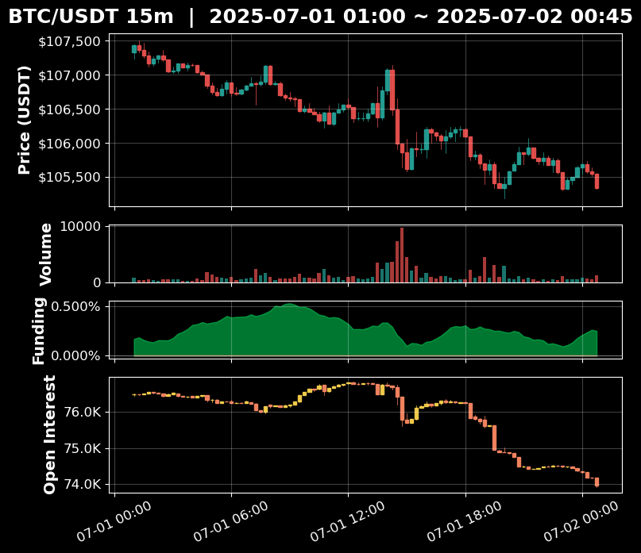
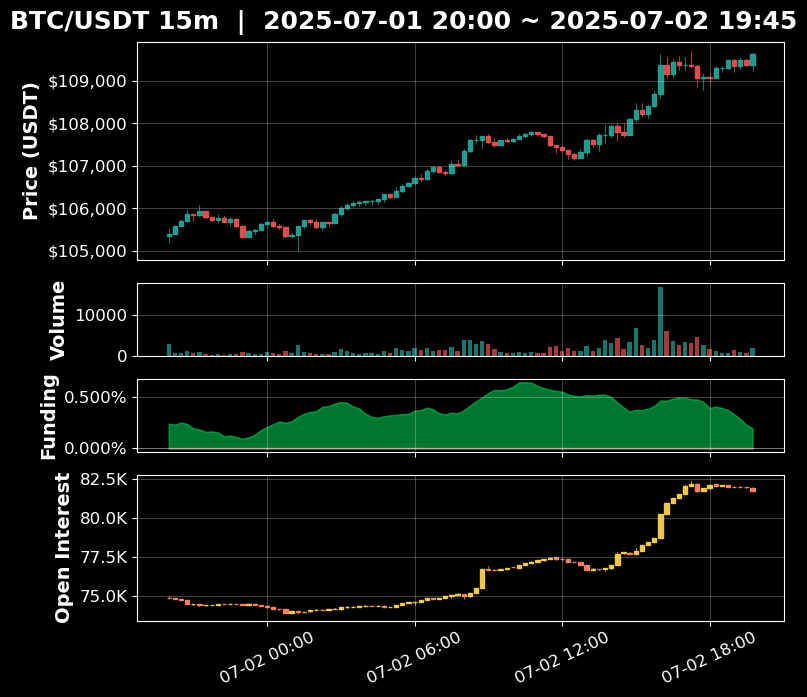
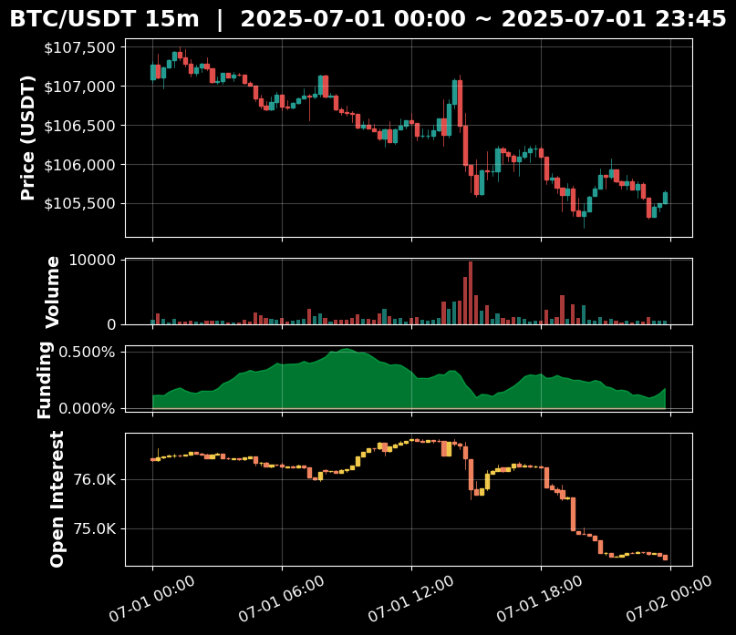
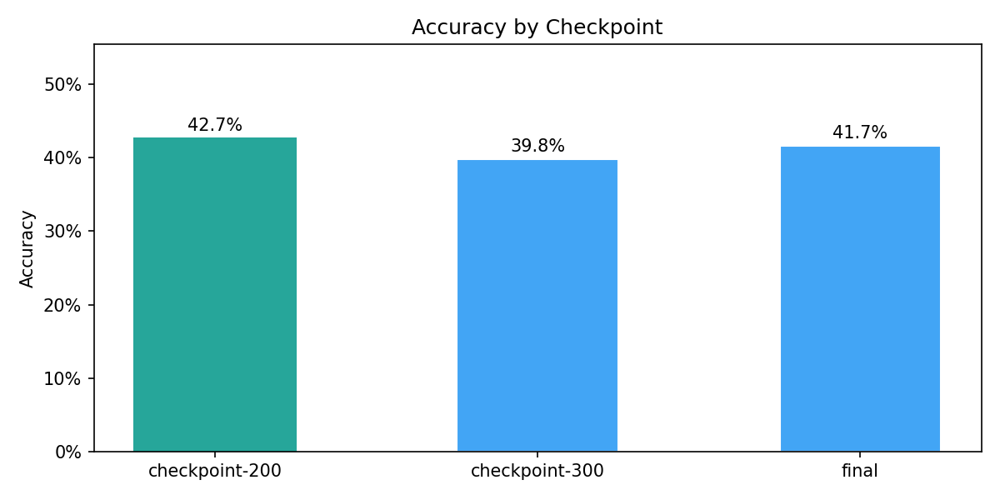
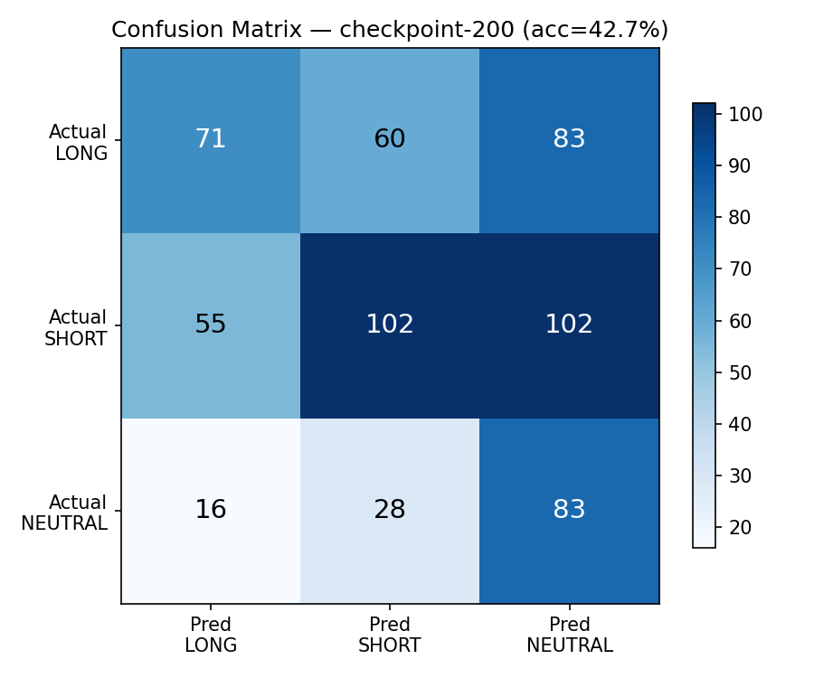
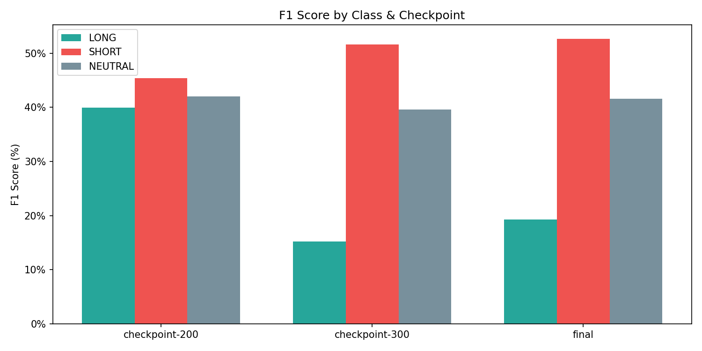

# Qwen3-VL 4B SFT + DPO Tutorial

Qwen3-VL-4B 비전 언어 모델을 SFT → DPO 순서로 파인튜닝하여 BTC 15분봉 차트 이미지를 분석하고 매매 신호(LONG/SHORT/NEUTRAL)를 예측하는 튜토리얼.

- [Qwen3-VL 4B 비트코인 차트 해석 모델 만들기 — 1편: 데이터셋 구축 (LoRA SFT/Distillation, DPO)](https://velog.io/@seawhale/Qwen3-VL-4B%EB%A1%9C-%EB%B9%84%ED%8A%B8%EC%BD%94%EC%9D%B8-%EC%B0%A8%ED%8A%B8-%ED%95%B4%EC%84%9D-%EB%AA%A8%EB%8D%B8-%EB%A7%8C%EB%93%A4%EA%B8%B0-LoRA-SFT-Distillation) [2025.03.14]


## Setup

### 1. 환경 생성

```bash
conda create -n btc python=3.11 -y
conda activate btc
```

### 2. PyTorch 설치 (CUDA 버전에 맞게)

```bash
# CUDA 12.x (FSDP2 requires PyTorch >= 2.6.0)
pip install torch>=2.6.0 torchvision --index-url https://download.pytorch.org/whl/cu124

# CUDA 11.8
pip install torch>=2.6.0 torchvision --index-url https://download.pytorch.org/whl/cu118
```

### 3. 의존성 설치

```bash
pip install -r requirements.txt
```

### 4. Locale 설정 (Linux 서버)

학습 중 체크포인트 저장 시 `UnicodeDecodeError`가 발생할 수 있다. `~/.bashrc`에 추가:

```bash
export LANG=en_US.UTF-8
export PYTHONIOENCODING=utf-8
```

### 5. GPU 확인

```bash
python -c "import torch; print(torch.cuda.is_available()); print(torch.cuda.get_device_name(0))"
```

### 6. .env (데이터 생성 시 필요)

```
OPENAI_API_KEY=sk-...
```

---

## Chart Examples

| LONG | SHORT | NEUTRAL |
|------|-------|---------|
|  |  |  |

---

## Step 0~3: 데이터 준비

```bash
# 0) 차트 이미지 생성 (균형 샘플링)
python data_prep/generate_charts.py --balanced 6000

# 1) Batch API 요청 생성
python data_prep/prepare_batch.py

# 2) Batch API 제출 + 결과 수집
python data_prep/submit_batch.py

# 3) 데이터셋 빌드
python data_prep/build_dataset.py
```

### 데이터셋 통계 확인

```bash
python shared/analyze_dataset.py
python shared/analyze_dataset.py --path data/teacher/dataset.jsonl
```

---

## SFT Training

```bash
# Single GPU
python sft/train.py --config sft/configs/single.yaml

# Multi GPU
accelerate launch --config_file sft/configs/fsdp2.yaml sft/train.py --config sft/configs/multi.yaml

# 소량 테스트
python sft/train.py --config sft/configs/single.yaml --max-samples 50
```

### SFT 하이퍼파라미터 (yaml로 조정)

| | Single GPU | Multi GPU |
|---|----------|-------------|
| Model | Qwen3-VL-4B-Instruct | Qwen3-VL-4B-Instruct |
| LoRA rank / alpha | 16 / 32 | 16 / 32 |
| Batch x Grad Accum | 1 x 16 = **16** | 4 x 4 = **16** (x2 GPU = **32**) |
| Learning Rate | 1e-4 | 5e-5 |
| Epochs | 2 | 2 |

### SFT Evaluation Results (checkpoint-200, Best)

테스트셋 600개 (LONG 214 / SHORT 259 / NEUTRAL 127)에 대한 vLLM 평가 결과.

**Accuracy: 42.7% | Macro F1: 42.4%**

#### Accuracy by Checkpoint



#### Confusion Matrix (checkpoint-200)



| | Pred LONG | Pred SHORT | Pred NEUTRAL | Recall |
|---|---|---|---|---|
| **LONG** | 71 | 60 | 83 | 33.2% |
| **SHORT** | 55 | 102 | 102 | 39.4% |
| **NEUTRAL** | 16 | 28 | 83 | 65.4% |

#### Classification Report

| Class | Precision | Recall | F1 | Support |
|---|---|---|---|---|
| LONG | 50.0% | 33.2% | 39.9% | 214 |
| SHORT | 53.7% | 39.4% | 45.4% | 259 |
| NEUTRAL | 31.0% | 65.4% | 42.0% | 127 |
| **Macro Avg** | 44.9% | 46.0% | 42.4% | |

#### F1 Score by Class & Checkpoint



| Checkpoint | Accuracy | LONG F1 | SHORT F1 | NEUTRAL F1 | Macro F1 |
|---|---|---|---|---|---|
| **checkpoint-200** | **42.7%** | **39.9%** | 45.4% | **42.0%** | **42.4%** |
| checkpoint-300 | 39.8% | 15.2% | **51.6%** | 39.6% | 35.5% |
| final | 41.7% | 19.3% | 52.6% | 41.6% | 37.8% |

> checkpoint-200 이후 LONG recall이 급락하며 SHORT 편향이 심화됨. epoch 1.33 시점이 최적.

---

## DPO Training

```bash
# 1) SFT LoRA → base 모델 머지 (vLLM용)
python grpo/merge_sft.py --config dpo/configs/single.yaml

# 2) vLLM으로 chosen/rejected 쌍 생성
python dpo/build_pairs.py --config dpo/configs/single.yaml

# 3) DPO 학습
python dpo/train.py --config dpo/configs/single.yaml

# Multi GPU
accelerate launch --num_processes 2 dpo/train.py --config dpo/configs/multi.yaml
```

### DPO 하이퍼파라미터 (yaml로 조정)

| 파라미터 | 설명 |
|---------|------|
| `beta` | KL penalty coefficient (기본 0.1) |
| `loss_type` | sigmoid / hinge / ipo |
| `pair_generation.num_samples_per_image` | vLLM에서 이미지당 N번 샘플링 |
| `pair_generation.temperature` | 샘플링 다양성 (기본 1.0) |

---

## Inference & Evaluation

```bash
# 테스트셋 이미지 + 정답 라벨 추출
python inference/extract_testset.py
python inference/extract_testset.py --max-samples 50

# 단일 이미지 예측
python inference/predict.py --image data/testset/chart_xxx.png
python inference/predict.py --adapter outputs/sft_lora/final --image data/testset/chart_xxx.png

# 테스트셋 일괄 평가 (결과는 outputs/eval_results/에 JSON 저장)
python inference/evaluate.py --adapter outputs/sft_lora/final
python inference/evaluate.py --adapter outputs/sft_lora/final --max-eval 50

# 모든 체크포인트 한번에 평가 (precision/recall/F1 포함)
python inference/evaluate_all.py --checkpoints-dir outputs/sft_lora
python inference/evaluate_all.py --checkpoints-dir outputs/sft_lora --max-eval 50

# vLLM으로 빠르게 평가 (LoRA 머지 필요)
python inference/merge_lora.py --checkpoints-dir outputs/sft_lora --output-dir outputs/merged
python inference/evaluate_all_vllm.py --models-dir outputs/merged

# SFT vs DPO 비교
python inference/compare.py
python inference/compare.py --max-eval 50

# Eval 결과 분석 (accuracy curve, confusion matrix, F1 비교)
python inference/analyze_eval.py --input eval_vllm_20260315_044221.json
python inference/analyze_eval.py --input eval_vllm_20260315_044221.json --save-dir outputs/eval_analysis
python inference/analyze_eval.py --input eval_vllm_20260315_044221.json --no-plot  # 텍스트만
```

---

## Monitoring

```bash
# SFT
tensorboard --logdir outputs/sft_lora --port 6006

# DPO
tensorboard --logdir outputs/dpo_lora --port 6007

# 원격 서버에서 실행 시 (외부 접근 허용)
tensorboard --logdir outputs/sft_lora --port 6006 --bind_all
# 브라우저에서 http://<서버IP>:6006 접속
```

---

## Tech Stack

| 구분 | SFT | DPO |
|------|-----|-----|
| 모델 | Qwen3-VL-4B-Instruct | Qwen3-VL-4B-Instruct |
| 프레임워크 | TRL + PEFT | TRL + PEFT |
| Trainer | SFTTrainer | DPOTrainer |
| 데이터 | teacher/dataset.jsonl | dpo_pairs.jsonl |
| 쌍 생성 | - | vLLM batch sampling |
| 파인튜닝 | LoRA (bf16) | SFT 위에 LoRA (bf16) |
| Loss | Cross-entropy | DPO sigmoid |
